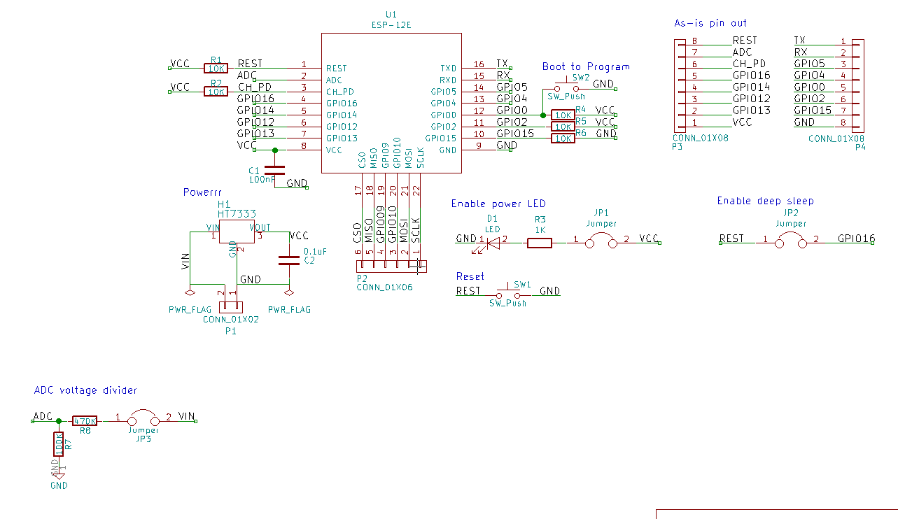
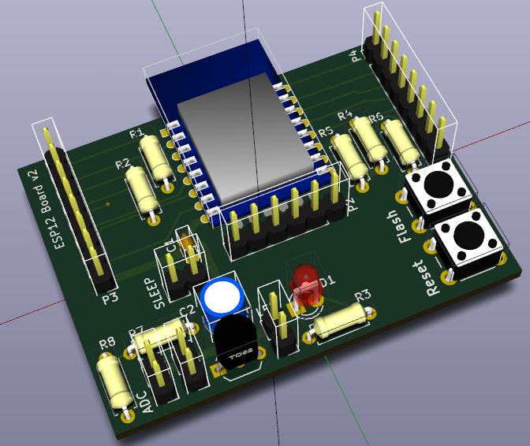
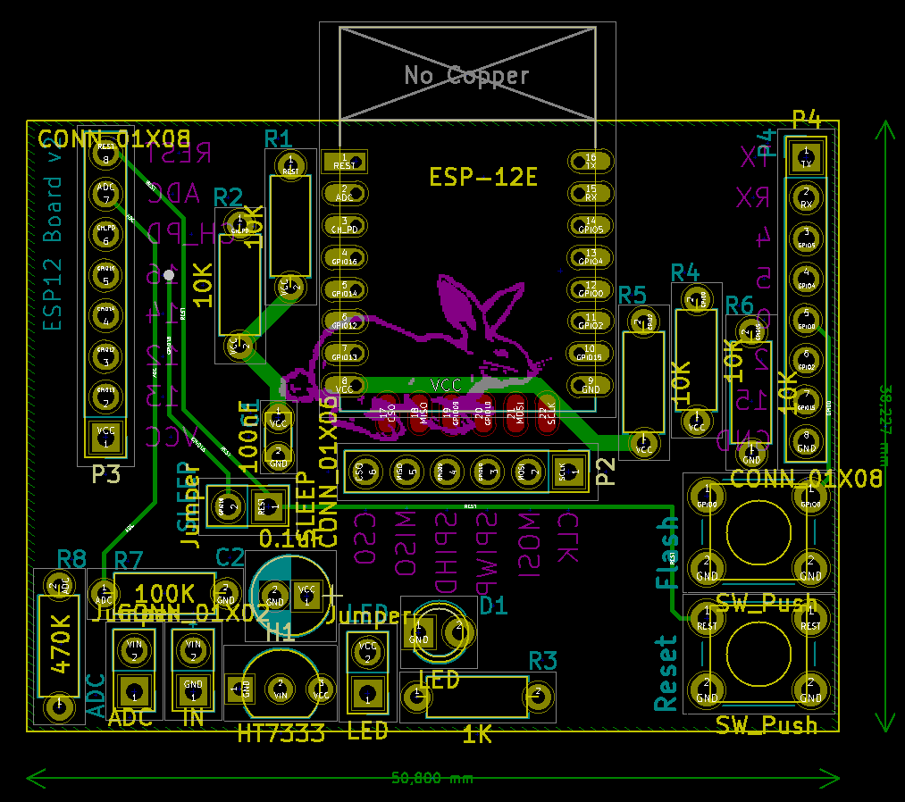

# ESP12Board
KiCad PCB design for ESP12 projects board.
This becomes my personal 'universal' breakout board for the ESP12.

- As small as possible
- Solderable by beginners
- Cheap components
- Feature rich

Get the latest release from: https://github.com/Thijxx/ESP12Board/releases

*I sent v2 to the manufacturer*

