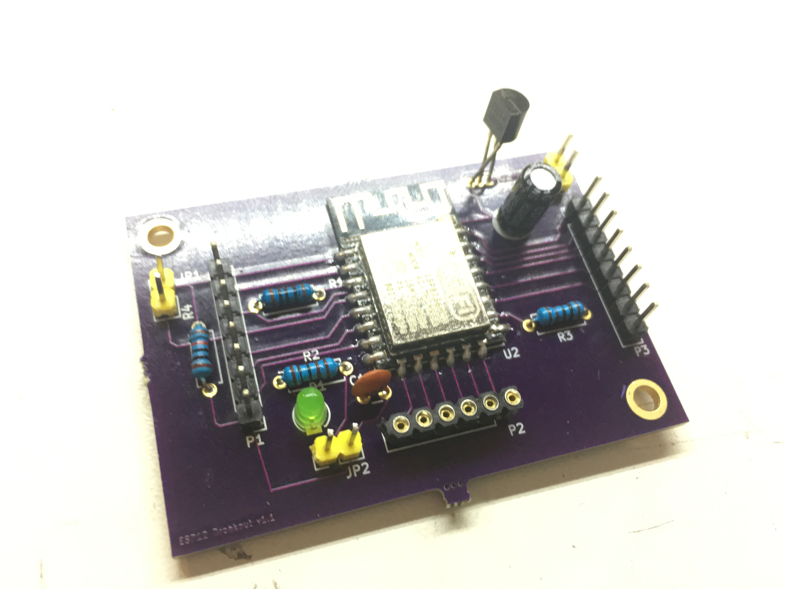
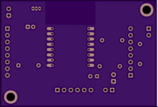

# ESP12Board
KiCad PCB design for ESP12 projects board.
My first PCB design, my first schematic and my first order at OSH.
Will update this page with my findings when I receive the boards and have tested (burned) them.

https://oshpark.com/shared_projects/X6JnTqLU

## Version 1
The circuit is for running projects, not for programming the ESP, I will program them with Over The Air update support before they go in.

- The jumper JP1 is for deep sleep. 
- The jumper JP2 is for the power LED. 
- 100nF stabilizer. 

### Issues with version 1
- Regulator footprint all wrong
- Capacitor C1 reversed footprint
- Lots of empty space on board ($$$)
- Not able to set in Flash mode on board

## Wishlist next version
- Programmable on the board using FTDI~~ possible as is, more easy with reset and program switches
- Optional integrated buck/boost
- Bill of material with links to products
- Smaller footprint
- Improved layout
- optional voltage divider for pre-regulator VCC measurement

### v1 Circuit

### v1 PCB  

### v1 Front  

### v1 Back  

