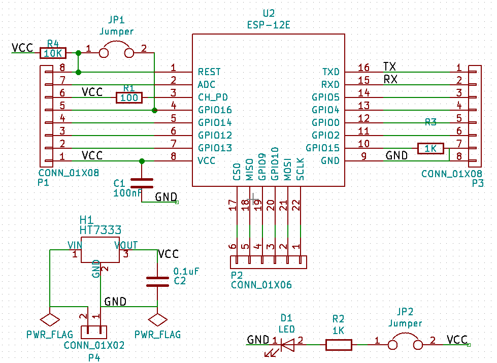
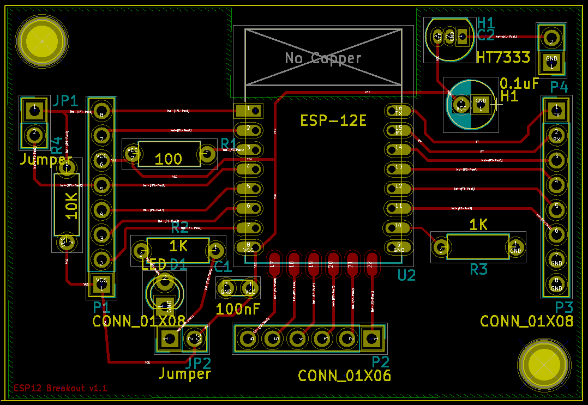

# ESP12Board
KiCad PCB design for ESP12 projects board.
My first PCB design, my first schematic and my first order at OSH.

https://oshpark.com/shared_projects/X6JnTqLU

## Version 1
The circuit is for running projects, not for programming the ESP, I will program them with Over The Air update support before they go in.

- The jumper JP1 is for deep sleep.
- The jumper JP2 is for the power LED. 
- 100nF stabilizer. 
- Consumption ~2.3mA with power LED and 0.8mA without

### v1 Circuit

### v1 PCB  

